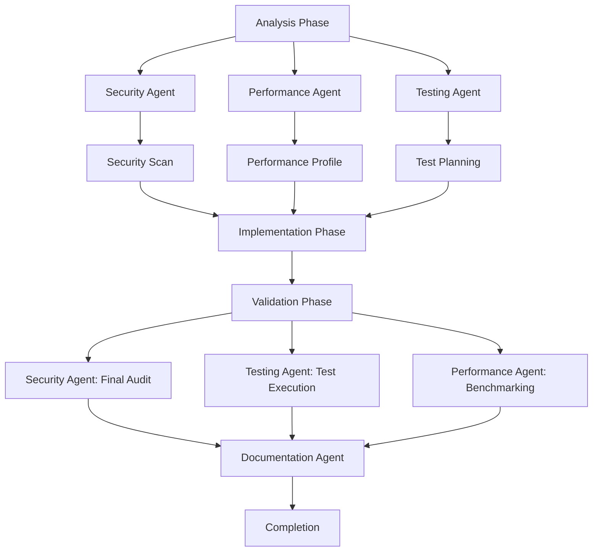

ccprompts provides powerful workflow automation capabilities that allow you to orchestrate complex multi-step processes with multiple specialized agents working in coordination.

## Understanding Workflow Automation

Workflow automation in ccprompts combines:

- **Intelligent command chaining** - Automatically sequence related commands
- **Multi-agent coordination** - Multiple specialists working together
- **Context preservation** - Maintain state across workflow steps
- **Error handling** - Graceful degradation and recovery
- **Conditional logic** - Adapt workflows based on results

## Workflow Types

ccprompts supports several workflow patterns:

<CardGroup cols={2}>
  <Card title="Development Workflows" icon="code" color="#0ea5e9">
    Complete feature development from analysis to deployment
    
    **Commands:** `/intelligent-chain`, `/workflow-automate development`
  </Card>
  
  <Card title="Deployment Workflows" icon="rocket" color="#10b981">
    Pre-deployment validation through production release
    
    **Commands:** `/workflow-automate deployment`, `/deploy`
  </Card>
  
  <Card title="Security Workflows" icon="shield" color="#ef4444">
    Vulnerability scanning, compliance checking, remediation
    
    **Commands:** `/workflow-automate security`, `/security-audit`
  </Card>
  
  <Card title="Testing Workflows" icon="flask" color="#a855f7">
    Test planning, execution, and validation
    
    **Commands:** `/workflow-automate testing`, `/test`
  </Card>
</CardGroup>

## Intelligent Command Chaining

The `/intelligent-chain` command automatically sequences commands based on natural language intent.

### Basic Usage

```bash
# Feature development workflow
/intelligent-chain "implement user authentication with JWT"

# Bug fixing workflow  
/intelligent-chain "fix memory leak in payment processor"

# Deployment preparation
/intelligent-chain "prepare production release v2.1.0"

# Code quality improvement
/intelligent-chain "improve test coverage and security"
```

### How It Works

<Steps>
  <Step title="Intent Analysis">
    Parses your natural language request to understand the goal:
    
    ```
    Input: "implement user authentication with JWT"
    Parsed Intent:
    - Type: Feature development
    - Domain: Authentication
    - Technology: JWT tokens
    - Scope: New implementation
    ```
  </Step>
  
  <Step title="Context Gathering">
    Examines your project to inform decisions:
    
    ```bash
    - Project type: Node.js/Express
    - Git status: Clean working directory
    - Recent commits: Added user model
    - Dependencies: express, bcrypt
    ```
  </Step>
  
  <Step title="Sequence Planning">
    Determines optimal command chain:
    
    ```
    Planned Sequence:
    1. /analyze-project → Understand architecture
    2. /security-audit → Review current auth
    3. /document → Plan JWT implementation
    4. /new-feature → Generate auth code
    5. /test → Create auth tests
    6. /security-audit → Validate security
    ```
  </Step>
  
  <Step title="Safe Execution">
    Runs commands with validation and rollback:
    
    ```
    Executing workflow...
    ✓ Step 1/6: Project analysis complete
    ✓ Step 2/6: Security audit passed
    ✓ Step 3/6: Implementation plan ready
    ✓ Step 4/6: Auth code generated
    ✓ Step 5/6: Tests created and passing
    ✓ Step 6/6: Security validation complete
    ```
  </Step>
  
  <Step title="Result Validation">
    Ensures each step completed successfully:
    
    ```
    Workflow Summary:
    - Duration: 3m 45s
    - Steps completed: 6/6
    - Tests passing: 12/12
    - Security issues: 0
    - Ready for review: Yes
    ```
  </Step>
</Steps>

### Common Workflow Patterns

<Accordion title="Feature Development">
  ```bash
  /intelligent-chain "new feature <description>"
  ```
  
  **Automatic sequence:**
  1. Project analysis → Understand current architecture
  2. Documentation → Plan feature implementation
  3. Code generation → Create feature code
  4. Test creation → Generate comprehensive tests
  5. Security audit → Validate security implications
  6. Documentation → Update API docs and guides
</Accordion>

<Accordion title="Bug Fixing">
  ```bash
  /intelligent-chain "fix bug in <component>"
  ```
  
  **Automatic sequence:**
  1. Debug session → Locate root cause
  2. Analysis → Understand impact and side effects
  3. Test creation → Add regression tests
  4. Fix implementation → Apply solution
  5. Validation → Verify fix and test coverage
  6. Documentation → Update changelog
</Accordion>

<Accordion title="Performance Optimization">
  ```bash
  /intelligent-chain "optimize database queries"
  ```
  
  **Automatic sequence:**
  1. Performance profiling → Identify bottlenecks
  2. Analysis → Understand query patterns
  3. Optimization → Implement improvements
  4. Benchmarking → Measure performance gains
  5. Validation → Ensure correctness
  6. Documentation → Document optimization techniques
</Accordion>

<Accordion title="Security Hardening">
  ```bash
  /intelligent-chain "security hardening"
  ```
  
  **Automatic sequence:**
  1. Security audit → Identify vulnerabilities
  2. Compliance check → Review against standards
  3. Hardening → Apply security measures
  4. Validation → Test security improvements
  5. Documentation → Update security docs
  6. Monitoring → Set up security alerts
</Accordion>

## Multi-Agent Workflows

The `/workflow-automate` command orchestrates multiple specialized agents for complex workflows.

### Workflow Types and Complexity

```bash
# Basic syntax
/workflow-automate [type] [complexity] [agents] [parameters]

# Examples
/workflow-automate development complex security,testing,performance
/workflow-automate deployment standard devops,security --environment=production
/workflow-automate testing simple testing --frameworks=jest,cypress
/workflow-automate security enterprise security,compliance --audit-level=comprehensive
```

### Complexity Levels

<Tabs>
  <Tab title="Simple">
    **Characteristics:**
    - 3-5 workflow steps
    - 1-2 agents
    - Linear execution
    - Basic error handling
    
    **Use cases:**
    - Quick testing workflows
    - Simple deployments
    - Basic code reviews
    
    **Example:**
    ```bash
    /workflow-automate testing simple testing --coverage=80
    ```
    
    **Workflow:**
    1. Test planning
    2. Test execution
    3. Coverage report
  </Tab>
  
  <Tab title="Standard">
    **Characteristics:**
    - 5-10 workflow steps
    - 2-4 agents
    - Sequential + some parallel
    - Advanced error handling
    
    **Use cases:**
    - Standard deployments
    - Feature development
    - Code quality workflows
    
    **Example:**
    ```bash
    /workflow-automate development standard security,testing
    ```
    
    **Workflow:**
    1. Code analysis
    2. Security scan (parallel)
    3. Test generation (parallel)
    4. Implementation
    5. Validation
    6. Documentation
  </Tab>
  
  <Tab title="Complex">
    **Characteristics:**
    - 10-20 workflow steps
    - 4-6 agents
    - Parallel execution
    - Conditional branching
    - Sophisticated error recovery
    
    **Use cases:**
    - Multi-service deployments
    - Major refactoring
    - Comprehensive audits
    
    **Example:**
    ```bash
    /workflow-automate development complex security,testing,performance,documentation
    ```
    
    **Workflow:**
    1. Architecture analysis
    2. Multi-agent analysis (parallel)
    3. Dependency resolution
    4. Implementation phases
    5. Integration testing
    6. Performance validation
    7. Security hardening
    8. Documentation generation
  </Tab>
  
  <Tab title="Enterprise">
    **Characteristics:**
    - 20+ workflow steps
    - 6+ agents
    - Fully parallel execution
    - Complex decision trees
    - Enterprise error handling
    - Audit logging
    - Compliance validation
    
    **Use cases:**
    - Enterprise deployments
    - Compliance workflows
    - Multi-repo coordination
    
    **Example:**
    ```bash
    /workflow-automate security enterprise security,compliance,audit,governance --framework=soc2
    ```
    
    **Workflow:**
    1. Compliance baseline
    2. Multi-repo scanning (parallel)
    3. Vulnerability assessment
    4. Remediation planning
    5. Policy enforcement
    6. Audit trail generation
    7. Compliance reporting
    8. Executive summary
  </Tab>
</Tabs>

### Agent Coordination Example

Here's how a complex development workflow coordinates multiple agents:

```bash
/workflow-automate development complex security,testing,performance,documentation
```

<CodeGroup>


```yaml Workflow Configuration
workflow:
  type: development
  complexity: complex
  
agents:
  - name: security
    role: Security analysis and hardening
    phases: [analysis, validation]
    
  - name: testing
    role: Test planning and execution
    phases: [analysis, validation]
    
  - name: performance
    role: Performance profiling and optimization
    phases: [analysis, validation]
    
  - name: documentation
    role: Documentation generation
    phases: [completion]

execution:
  parallel:
    - security_scan
    - performance_profile
    - test_planning
  
  sequential:
    - implementation
    - validation
    - documentation
  
error_handling:
  strategy: graceful_degradation
  rollback: enabled
  notifications: enabled
```
</CodeGroup>

## State Management and Context

Workflows maintain state across steps for intelligent coordination.

### Context Preservation

```javascript
// Workflow context example
{
  "workflow_id": "wf_dev_complex_123",
  "type": "development",
  "complexity": "complex",
  "started_at": "2026-03-14T10:30:00Z",
  
  // Project context
  "project": {
    "type": "node-express",
    "git_status": "clean",
    "dependencies": ["express", "jest", "typescript"]
  },
  
  // Workflow state
  "current_step": 4,
  "total_steps": 12,
  "completed": ["analysis", "security_scan", "test_plan"],
  
  // Agent states
  "agents": {
    "security": {
      "status": "completed",
      "findings": 3,
      "severity": "medium"
    },
    "testing": {
      "status": "in_progress",
      "tests_created": 15,
      "coverage": 85
    }
  },
  
  // Shared data
  "artifacts": {
    "security_report": "/tmp/security-report.json",
    "test_plan": "/tmp/test-plan.md",
    "performance_profile": "/tmp/perf-profile.json"
  }
}
```

### Checkpoint and Resume

Workflows support checkpointing for long-running processes:

```bash
# Workflow automatically checkpoints at each major phase
✓ Checkpoint 1: Analysis complete
✓ Checkpoint 2: Security scan complete
⚠ Workflow interrupted

# Resume from last checkpoint
/workflow-resume wf_dev_complex_123

# Continue from checkpoint 2
✓ Checkpoint 3: Implementation complete
✓ Checkpoint 4: Validation complete
```

## Error Handling and Recovery

Sophisticated error handling ensures workflow reliability.

### Error Strategies

<Tabs>
  <Tab title="Retry with Backoff">
    Automatically retry transient failures:
    
    ```yaml
    error_handling:
      retry:
        max_attempts: 3
        backoff: exponential
        initial_delay: 1s
        max_delay: 30s
    ```
    
    **Example:**
    ```
    Step: Security scan
    ✗ Attempt 1: Network timeout (retrying in 1s...)
    ✗ Attempt 2: Network timeout (retrying in 2s...)
    ✓ Attempt 3: Success
    ```
  </Tab>
  
  <Tab title="Graceful Degradation">
    Continue with reduced functionality:
    
    ```yaml
    error_handling:
      strategy: degrade_gracefully
      optional_steps:
        - performance_benchmark
        - documentation_generation
    ```
    
    **Example:**
    ```
    Step: Performance benchmark
    ✗ Failed: Benchmark service unavailable
    ⚠ Continuing without performance metrics
    ✓ Workflow continues with core functionality
    ```
  </Tab>
  
  <Tab title="Rollback">
    Revert changes on critical failures:
    
    ```yaml
    error_handling:
      strategy: rollback
      critical_steps:
        - database_migration
        - deployment
    ```
    
    **Example:**
    ```
    Step: Database migration
    ✗ Critical failure: Migration failed
    ⟲ Rolling back changes...
    ✓ Rollback complete
    ✓ System restored to previous state
    ```
  </Tab>
  
  <Tab title="Escalation">
    Notify and request human intervention:
    
    ```yaml
    error_handling:
      strategy: escalate
      escalation:
        notify: team@company.com
        pause_workflow: true
    ```
    
    **Example:**
    ```
    Step: Production deployment
    ✗ Critical failure: Health check failed
    ⏸ Workflow paused
    📧 Notification sent to DevOps team
    ⏳ Awaiting manual intervention...
    ```
  </Tab>
</Tabs>

## Conditional Workflows

Workflows adapt based on conditions and results.

### Conditional Branching

```yaml
workflow:
  - step: security_scan
    next:
      if: security.severity == "critical"
      then: immediate_remediation
      else: continue_deployment
      
  - step: test_execution
    next:
      if: testing.coverage < 80
      then: generate_more_tests
      else: validation
      
  - step: performance_check
    next:
      if: performance.latency > threshold
      then: optimization_phase
      else: documentation
```

### Real Example: Deployment Workflow

```bash
/workflow-automate deployment standard devops,security --environment=production
```

<Steps>
  <Step title="Pre-Flight Checks">
    ```
    ✓ Git status: Clean working directory
    ✓ Tests: All passing (45/45)
    ✓ Build: Successful
    ✓ Dependencies: Up to date
    
    Condition: All checks passed → Continue
    ```
  </Step>
  
  <Step title="Security Scan">
    ```
    ⚠ Security findings: 2 medium severity issues
    
    Condition: Medium severity → Request approval
    Action: Display findings and await confirmation
    
    ✓ Team approved deployment with known issues
    ```
  </Step>
  
  <Step title="Deployment">
    ```
    ✓ Staging deployment: Successful
    ✓ Health check: Passing
    ✓ Smoke tests: Passing
    
    Condition: Staging successful → Deploy to production
    ```
  </Step>
  
  <Step title="Production Deployment">
    ```
    ✓ Production deployment: Successful
    ✗ Health check: 1 endpoint failing
    
    Condition: Health check failed → Automatic rollback
    ⟲ Rolling back deployment...
    ✓ Rollback complete
    ```
  </Step>
  
  <Step title="Post-Mortem">
    ```
    ✓ Incident report generated
    ✓ Team notified
    ✓ Logs collected
    
    Next action: Review health check failure
    ```
  </Step>
</Steps>

## Monitoring and Analytics

### Real-Time Monitoring

```
Workflow: development-complex-wf_123
Status: In Progress (Step 6/12)

┌─────────────────────────────────────────┐
│ Progress: ████████████░░░░░░░░ 50%     │
│ Duration: 3m 42s / ~7m 30s estimated    │
└─────────────────────────────────────────┘

Agent Status:
  ✓ Security Agent:     Completed (2m 15s)
  ⟳ Testing Agent:      In Progress (1m 27s)
  ⏳ Performance Agent:  Queued
  ⏳ Documentation:      Queued

Recent Activity:
  [10:32:15] Security scan completed
  [10:32:45] Test generation started
  [10:33:30] 15 tests created
  [10:34:12] Running test suite...
```

### Analytics and Insights

```yaml
Workflow Analytics:
  success_rate: 94.2%
  average_duration: 6m 23s
  
Common Bottlenecks:
  - Security scan: 35% of total time
  - Test execution: 28% of total time
  
Optimization Opportunities:
  - Parallelize security scan and test generation
  - Cache dependency installations
  - Use faster test runners
  
Predicted Improvement: 25% faster execution
```

## Best Practices

### Start Simple

<Steps>
  <Step title="Begin with intelligent-chain">
    Let ccprompts automatically determine the workflow:
    
    ```bash
    /intelligent-chain "implement user authentication"
    ```
  </Step>
  
  <Step title="Progress to simple workflows">
    Use `/workflow-automate` for more control:
    
    ```bash
    /workflow-automate development simple testing
    ```
  </Step>
  
  <Step title="Advance to complex workflows">
    Coordinate multiple agents:
    
    ```bash
    /workflow-automate development complex security,testing,performance
    ```
  </Step>
  
  <Step title="Scale to enterprise">
    Full orchestration with compliance:
    
    ```bash
    /workflow-automate deployment enterprise devops,security,compliance --audit=full
    ```
  </Step>
</Steps>

### Safety First

<Card title="Workflow Safety Checklist" icon="clipboard-check">
  - ✓ Always commit changes before running workflows
  - ✓ Test workflows in development first
  - ✓ Review automated changes before applying
  - ✓ Ensure rollback procedures are in place
  - ✓ Monitor workflow execution in real-time
  - ✓ Validate results at each checkpoint
  - ✓ Keep team informed of automated changes
</Card>

## Next Steps

<CardGroup cols={2}>
  <Card title="MCP Integration" href="/advanced/mcp-integration" icon="plug">
    Extend workflows with MCP server capabilities
  </Card>
  
  <Card title="Creating Agents" href="/advanced/creating-agents" icon="robot">
    Build custom agents for workflow orchestration
  </Card>
  
  <Card title="Multi-Repo Management" href="/advanced/multi-repo-management" icon="folder-tree">
    Coordinate workflows across multiple repositories
  </Card>
  
  <Card title="Command Reference" href="/commands/overview" icon="book">
    Browse all workflow commands
  </Card>
</CardGroup>