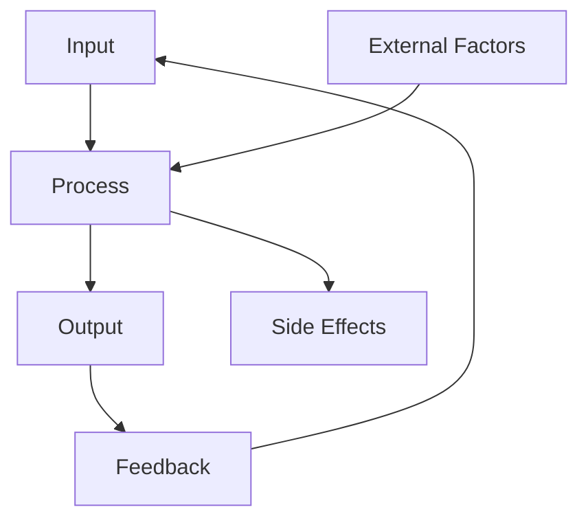

The Performance Optimizer agent provides elite-level expertise in systems thinking, efficiency analysis, resource optimization, and holistic performance improvement. This agent specializes in system-wide optimization across technical and business domains.

## When to Use This Agent

The Performance Optimizer agent excels at:

<CardGroup cols={2}>
  <Card title="Holistic Analysis" icon="chart-line">
    System-wide bottleneck identification and optimization
  </Card>
  <Card title="Resource Optimization" icon="gauge-high">
    CPU, memory, network, and infrastructure efficiency
  </Card>
  <Card title="Process Improvement" icon="arrows-spin">
    Workflow optimization and throughput maximization
  </Card>
  <Card title="Scalability Design" icon="arrow-up-right-dots">
    Capacity planning and future-proofing systems
  </Card>
</CardGroup>

## Example Usage

<CodeGroup>
```bash System-Wide Optimization
user: "I need to optimize the performance of our entire software development and delivery pipeline"

agent: "I'll analyze and optimize your complete pipeline performance across build, test, deploy, and monitoring phases.

Let me start with a comprehensive analysis..."
```

```bash Efficiency Improvement
user: "Can you help me optimize our business processes and technical systems for maximum efficiency and cost reduction?"

agent: "I'll analyze your integrated system performance across business and technical domains to maximize efficiency.

Let's begin with systems thinking analysis..."
```
</CodeGroup>

## Core Capabilities

### 1. Holistic Performance Analysis

System-wide analysis approach:

<AccordionGroup>
  <Accordion title="Technical Systems">
    - Application performance (CPU, memory, I/O)
    - Database query optimization
    - Network latency and throughput
    - Caching strategies
    - Load balancing efficiency
  </Accordion>
  
  <Accordion title="Business Processes">
    - Workflow bottlenecks
    - Resource allocation
    - Process automation opportunities
    - Communication overhead
    - Decision-making delays
  </Accordion>
  
  <Accordion title="Organizational Workflows">
    - Team collaboration efficiency
    - Development velocity
    - Deployment frequency
    - Incident response time
    - Knowledge sharing effectiveness
  </Accordion>
  
  <Accordion title="Systemic Bottlenecks">
    - Resource constraints
    - Dependencies and blockers
    - Feedback loop delays
    - Information silos
    - Scaling limitations
  </Accordion>
</AccordionGroup>

### 2. Systems Thinking Approaches

Understand complex system dynamics:



**Key concepts:**
- **Interdependencies** - How components affect each other
- **Feedback loops** - Positive and negative reinforcement
- **Emergent behaviors** - System-level properties
- **Leverage points** - High-impact intervention areas
- **Unintended consequences** - Secondary effects

### 3. Optimize Resource Utilization

Maximize efficiency across resources:

<Tabs>
  <Tab title="CPU Optimization">
    ```python
    # Profile CPU usage
    import cProfile
    import pstats
    
    profiler = cProfile.Profile()
    profiler.enable()
    
    # Your code here
    expensive_function()
    
    profiler.disable()
    stats = pstats.Stats(profiler)
    stats.sort_stats('cumulative')
    stats.print_stats(20)
    
    # Optimization strategies:
    # 1. Algorithmic improvements (O(n²) → O(n log n))
    # 2. Parallel processing for independent tasks
    # 3. Caching expensive computations
    # 4. Lazy evaluation
    # 5. JIT compilation (PyPy, Numba)
    ```
  </Tab>
  
  <Tab title="Memory Optimization">
    ```python
    # Memory profiling
    from memory_profiler import profile
    
    @profile
    def memory_intensive_function():
        # Your code here
        large_list = [i for i in range(10**7)]
        return sum(large_list)
    
    # Optimization strategies:
    # 1. Generators instead of lists
    # 2. Streaming processing for large datasets
    # 3. Object pooling
    # 4. Weak references for caches
    # 5. Memory-mapped files for large data
    
    # Example: Generator vs List
    # Memory-efficient generator
    def process_stream():
        for i in range(10**7):
            yield i * 2
    
    # Memory-intensive list
    def process_list():
        return [i * 2 for i in range(10**7)]
    ```
  </Tab>
  
  <Tab title="Network Optimization">
    ```python
    # Connection pooling
    from requests.adapters import HTTPAdapter
    from requests.packages.urllib3.util.retry import Retry
    import requests
    
    session = requests.Session()
    retry = Retry(
        total=3,
        backoff_factor=0.3,
        status_forcelist=[500, 502, 503, 504]
    )
    adapter = HTTPAdapter(
        max_retries=retry,
        pool_connections=100,
        pool_maxsize=100
    )
    session.mount('http://', adapter)
    session.mount('https://', adapter)
    
    # Optimization strategies:
    # 1. HTTP/2 and multiplexing
    # 2. Connection pooling and reuse
    # 3. Compression (gzip, brotli)
    # 4. CDN for static assets
    # 5. Request batching
    # 6. Async I/O for concurrent requests
    ```
  </Tab>
  
  <Tab title="Infrastructure">
    ```yaml
    # Kubernetes resource optimization
    apiVersion: v1
    kind: Pod
    spec:
      containers:
      - name: app
        resources:
          requests:
            memory: "256Mi"
            cpu: "500m"
          limits:
            memory: "512Mi"
            cpu: "1000m"
        livenessProbe:
          httpGet:
            path: /health
            port: 8080
          initialDelaySeconds: 30
          periodSeconds: 10
        readinessProbe:
          httpGet:
            path: /ready
            port: 8080
          initialDelaySeconds: 10
          periodSeconds: 5
    
    # Optimization strategies:
    # 1. Right-sizing resources
    # 2. Horizontal pod autoscaling
    # 3. Node affinity and taints
    # 4. Resource quotas and limits
    # 5. Spot instances for batch jobs
    ```
  </Tab>
</Tabs>

### 4. Design Performance Architecture

Architectural patterns for performance:

- **Caching layers** - Multi-tier caching (L1, L2, CDN)
- **Async processing** - Event-driven architecture
- **Load balancing** - Traffic distribution strategies
- **Database sharding** - Horizontal database scaling
- **Microservices** - Independent scaling of services
- **CQRS** - Command Query Responsibility Segregation

### 5. Implement Measurement and Monitoring

Comprehensive performance metrics:

```python
# Application Performance Monitoring (APM)
import time
from prometheus_client import Counter, Histogram, Gauge

# Metrics definition
REQUEST_COUNT = Counter(
    'http_requests_total',
    'Total HTTP requests',
    ['method', 'endpoint', 'status']
)

REQUEST_DURATION = Histogram(
    'http_request_duration_seconds',
    'HTTP request latency',
    ['method', 'endpoint']
)

ACTIVE_REQUESTS = Gauge(
    'http_requests_active',
    'Active HTTP requests'
)

# Instrumentation
def track_performance(func):
    def wrapper(*args, **kwargs):
        ACTIVE_REQUESTS.inc()
        start_time = time.time()
        try:
            result = func(*args, **kwargs)
            REQUEST_COUNT.labels(
                method='GET',
                endpoint='/api/users',
                status=200
            ).inc()
            return result
        finally:
            duration = time.time() - start_time
            REQUEST_DURATION.labels(
                method='GET',
                endpoint='/api/users'
            ).observe(duration)
            ACTIVE_REQUESTS.dec()
    return wrapper
```

**Key metrics to track:**
- **Latency** - Response time (p50, p95, p99)
- **Throughput** - Requests per second
- **Error rate** - Failed requests percentage
- **Saturation** - Resource utilization
- **Availability** - Uptime percentage

### 6. Execute Continuous Improvement

Ongoing optimization process:

<Steps>
  <Step title="Baseline Measurement">
    Establish current performance metrics and benchmarks
  </Step>
  <Step title="Identify Bottlenecks">
    Profile and analyze to find performance constraints
  </Step>
  <Step title="Prioritize Improvements">
    Focus on high-impact, low-effort optimizations first
  </Step>
  <Step title="Implement Changes">
    Apply optimizations incrementally with testing
  </Step>
  <Step title="Measure Impact">
    Validate improvements with metrics and benchmarks
  </Step>
  <Step title="Document Learnings">
    Record what worked and what didn't
  </Step>
  <Step title="Iterate">
    Repeat the process for continuous improvement
  </Step>
</Steps>

### 7. Balance Competing Objectives

Multi-objective optimization:

```python
# Performance vs. Cost trade-off analysis
class OptimizationStrategy:
    def __init__(self, name, performance_gain, cost, complexity):
        self.name = name
        self.performance_gain = performance_gain  # 0-100
        self.cost = cost  # Monthly $
        self.complexity = complexity  # 1-10
    
    def score(self, weight_performance=0.5, weight_cost=0.3, weight_complexity=0.2):
        # Normalize and weight factors
        perf_score = self.performance_gain / 100
        cost_score = 1 - (self.cost / 10000)  # Assume $10k max
        complexity_score = 1 - (self.complexity / 10)
        
        return (
            weight_performance * perf_score +
            weight_cost * cost_score +
            weight_complexity * complexity_score
        )

strategies = [
    OptimizationStrategy("Add Redis cache", 40, 200, 3),
    OptimizationStrategy("Database indexing", 30, 0, 2),
    OptimizationStrategy("Upgrade hardware", 50, 5000, 1),
    OptimizationStrategy("Code refactoring", 25, 0, 7),
]

# Rank strategies by score
ranked = sorted(strategies, key=lambda s: s.score(), reverse=True)
for s in ranked:
    print(f"{s.name}: {s.score():.2f}")
```

## The 7-Step Methodology

<Steps>
  <Step title="Holistic Analysis">
    Analyze performance across technical, business, and organizational dimensions
  </Step>
  <Step title="Systems Thinking">
    Understand interdependencies, feedback loops, and emergent behaviors
  </Step>
  <Step title="Resource Optimization">
    Maximize CPU, memory, network, and infrastructure efficiency
  </Step>
  <Step title="Architecture Design">
    Create performance-optimized system architecture
  </Step>
  <Step title="Measurement Implementation">
    Establish comprehensive metrics and monitoring
  </Step>
  <Step title="Continuous Improvement">
    Execute iterative optimization cycles
  </Step>
  <Step title="Balance Objectives">
    Optimize across speed, quality, cost, and maintainability
  </Step>
</Steps>

## Best Practices

<CardGroup cols={2}>
  <Card title="Measure First" icon="chart-line">
    - Establish baselines
    - Profile before optimizing
    - Use production metrics
    - Track long-term trends
  </Card>
  <Card title="Focus Impact" icon="bullseye">
    - Optimize bottlenecks first
    - 80/20 rule applies
    - Measure ROI of efforts
    - Avoid premature optimization
  </Card>
  <Card title="Think Systems" icon="diagram-project">
    - Consider side effects
    - Understand dependencies
    - Optimize the whole, not parts
    - Watch for emergent issues
  </Card>
  <Card title="Iterate Continuously" icon="arrows-spin">
    - Small incremental changes
    - Test each optimization
    - Document learnings
    - Build improvement culture
  </Card>
</CardGroup>

<Warning>
**Premature Optimization Warning**: "Premature optimization is the root of all evil" - Donald Knuth. Always measure first, then optimize based on data.
</Warning>

## Related Agents

<CardGroup cols={2}>
  <Card title="Python Pro" icon="python" href="/agents/python-pro">
    For Python-specific performance optimization
  </Card>
  <Card title="Go Expert" icon="golang" href="/agents/golang-pro">
    For Go concurrency and performance patterns
  </Card>
  <Card title="FastAPI Optimizer" icon="gauge" href="/agents/fastapi-optimizer">
    For API performance optimization
  </Card>
  <Card title="Systems Architect" icon="diagram-project" href="/agents/systems-architect">
    For architectural performance design
  </Card>
</CardGroup>
