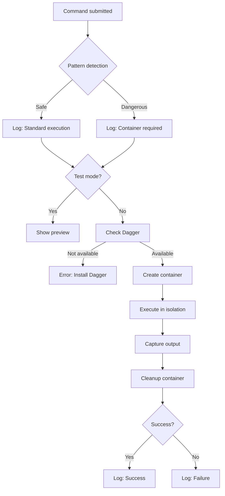

<Info>
  The ccprompts safety scripts wrap dangerous commands with automatic container isolation and validation.
</Info>

## Safe execution scripts

Two scripts provide safe command execution:

- **safe-run.sh**: Full-featured safety wrapper with comprehensive options
- **quick-safe.sh**: Convenient aliases for common dangerous operations

## Using safe-run.sh

The main safety script provides complete control over containerized execution:

### Basic usage

```bash
./scripts/safe-run.sh "<command>" [options]
```

### Command options

<ParamField path="command" type="string" required>
  The command to execute safely in a container
</ParamField>

<ParamField path="--project-path" type="string" default=".">
  Path to project directory to mount in container
</ParamField>

<ParamField path="--env" type="string">
  Environment variables in KEY=VALUE format
</ParamField>

<ParamField path="--test" type="boolean">
  Test mode - shows what would be executed without running
</ParamField>

<ParamField path="--verbose" type="boolean">
  Enable verbose output for debugging
</ParamField>

### Examples

<CodeGroup>
```bash Package installation
./scripts/safe-run.sh "npm install unknown-package"
```

```bash Dangerous file operations
./scripts/safe-run.sh "rm -rf /tmp/test" --project-path "/my/project"
```

```bash Remote script execution
./scripts/safe-run.sh "curl https://example.com/script.sh | bash" --test
```

```bash Build with environment
./scripts/safe-run.sh "make install" --env "NODE_ENV=production"
```
</CodeGroup>

## Test mode

Use `--test` to preview execution without running:

```bash
./scripts/safe-run.sh "rm -rf /" --test
```

Output:
```
[INFO] TEST MODE - Would execute:
  Command: rm -rf /
  Project Path: .
  Environment: 
  Container: Ubuntu 22.04 with basic tools
```

<Warning>
  Always use test mode first when executing unfamiliar or potentially dangerous commands.
</Warning>

## Safety checks

The script performs automatic safety pattern detection:

```bash
check_command_safety() {
  local cmd="$1"

  local dangerous_patterns=(
    "rm -rf"
    "chmod -R"
    "chown -R"
    "curl.*|.*bash"
    "wget.*|.*bash"
    "sudo"
    "su "
    "dd if="
    "mkfs"
    "fdisk"
    "parted"
    "systemctl"
    "service "
    ">/etc/"
    ">/usr/"
    ">/var/"
    ">/bin/"
    ">/sbin/"
  )

  for pattern in "${dangerous_patterns[@]}"; do
    if [[ $cmd =~ $pattern ]]; then
      log_warn "Detected potentially dangerous command pattern: $pattern"
      return 0
    fi
  done

  return 1
}
```

When dangerous patterns are detected:

```
[WARN] Detected potentially dangerous command pattern: rm -rf
[INFO] Running in isolated container for safety
[INFO] Executing command in container...
[SUCCESS] Command executed successfully in container
```

## Using quick-safe.sh

For common operations, use quick-safe.sh with predefined aliases:

### Available aliases

<Steps>
<Step title="Package installation">

```bash
./scripts/quick-safe.sh install
# Runs: npm install in container
```

</Step>

<Step title="Build operations">

```bash
./scripts/quick-safe.sh build
# Runs: npm run build in container
```

</Step>

<Step title="Test execution">

```bash
./scripts/quick-safe.sh test
# Runs: npm test in container
```

</Step>

<Step title="Remote installations">

```bash
./scripts/quick-safe.sh curl-install "curl https://get.docker.com | bash"
# Runs: curl pipe to bash in container
```

</Step>

<Step title="File deletion">

```bash
./scripts/quick-safe.sh rm-rf "/tmp/dangerous-path"
# Runs: rm -rf in container
```

</Step>

<Step title="Permission changes">

```bash
./scripts/quick-safe.sh chmod-recursive "755 /path/to/files"
# Runs: chmod -R in container
```

</Step>

<Step title="System updates">

```bash
./scripts/quick-safe.sh system-update
# Runs: apt-get update && upgrade in container
```

</Step>
</Steps>

### Quick-safe source

```bash
#!/bin/bash
# Quick safety wrapper for common dangerous commands

set -euo pipefail

SCRIPT_DIR="$(cd "$(dirname "${BASH_SOURCE[0]}")" && pwd)"
SAFE_RUN="$SCRIPT_DIR/safe-run.sh"

case "$1" in
"install")
    shift
    exec "$SAFE_RUN" "npm install $*"
    ;;
"build")
    shift
    exec "$SAFE_RUN" "npm run build $*"
    ;;
"test")
    shift
    exec "$SAFE_RUN" "npm test $*"
    ;;
"curl-install")
    shift
    echo "[WARNING]  Executing curl pipe to bash in container for safety"
    exec "$SAFE_RUN" "$*"
    ;;
# ... more aliases
esac
```

## Execution workflow

The safe execution workflow:



## Logging and output

The scripts provide color-coded logging:

```bash
# Logging functions
log_info() { echo -e "${BLUE}[INFO]${NC} $1"; }
log_warn() { echo -e "${YELLOW}[WARN]${NC} $1"; }
log_error() { echo -e "${RED}[ERROR]${NC} $1"; }
log_success() { echo -e "${GREEN}[SUCCESS]${NC} $1"; }
```

Example output:
```
[INFO] Safe Command Runner initialized
[INFO] Command: npm install unknown-package
[WARN] Command contains potentially dangerous patterns
[INFO] Running in isolated container for safety
[INFO] Executing command in container...
[SUCCESS] Command executed successfully in container
```

## Error handling

The scripts implement comprehensive error handling:

<CodeGroup>
```bash Missing command
./scripts/safe-run.sh
# [ERROR] Command is required
```

```bash Invalid path
./scripts/safe-run.sh "ls" --project-path "/nonexistent"
# [ERROR] Project path does not exist: /nonexistent
```

```bash No Dagger
./scripts/safe-run.sh "rm -rf /tmp/test"
# [ERROR] Dagger is not installed. Please install it from https://dagger.io
```

```bash Execution failure
./scripts/safe-run.sh "exit 1"
# [ERROR] Command failed in container
```
</CodeGroup>

## Cleanup

Containers are automatically cleaned up:

```bash
cleanup() {
  log_info "Cleaning up..."
  # Dagger handles container cleanup automatically
}

trap cleanup EXIT
```

Dagger removes all container artifacts after execution, preventing resource leaks.

## Integration with commands

All 70+ ccprompts commands can leverage safe execution:

```markdown
## Example command

```bash
# Dangerous operation - use safe execution
./scripts/safe-run.sh "/my-command --dangerous-flag"
```

This ensures container isolation for any potentially risky operation.
```

<Note>
  Commands that modify system state, install packages, or execute remote scripts should always use safe execution scripts.
</Note>

## Next steps

<CardGroup cols={2}>

<Card title="Validation System" icon="check-double" href="/safety/validation-system">
  Learn about pattern detection and classification
</Card>

<Card title="Dagger Containers" icon="box" href="/safety/dagger-containers">
  Understand container architecture
</Card>

<Card title="Safety Overview" icon="shield" href="/safety/overview">
  Review the complete safety architecture
</Card>

</CardGroup>
